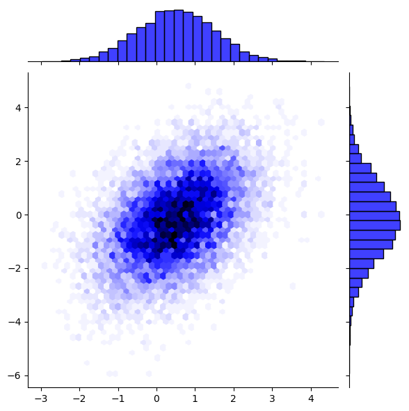
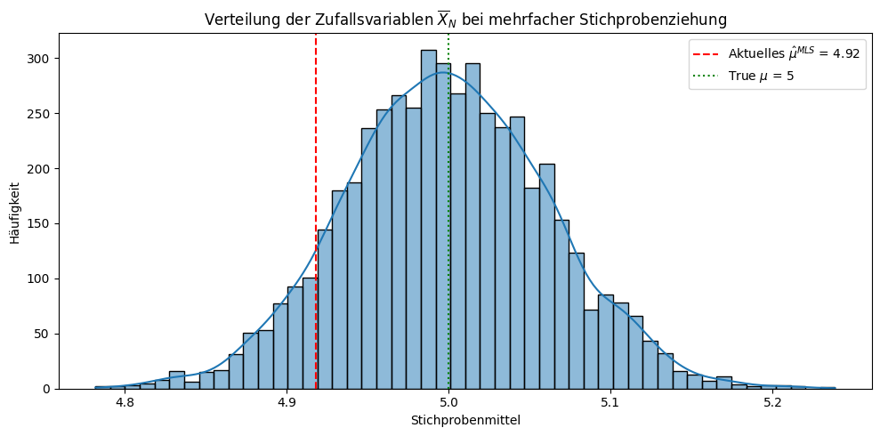

# Data Science & Statistik – Notebooksammlung

Diese Sammlung enthält interaktive Jupyter Notebooks zu verschiedenen Themen der Datenanalyse, Statistik und maschinellen Lernverfahren.

## Inhaltsverzeichnis

### Datenvorverarbeitung & Visualisierung
- **pandas** – Daten einlesen, filtern, transformieren  
- **matplotlib / plotly** – statische und interaktive Visualisierungen  
- **Kerndichteschätzung, Histogramme, Profilplots** – explorative Analyse

### Überwachtes Lernen (Supervised Learning)
- **Lineare Regression** – lineare Modelle, Fehlerfunktionen  
- **SVMs** – Klassifikation, Hyperplane-Konzepte  
- **ROC-Kurven** – Modellbewertung  
- **Stock-NN** – Zeitreihenprognose mit neuronalen Netzen

### Unüberwachtes Lernen (Unsupervised Learning)
- **k-means** – Clustering-Verfahren  
- **PCA** – Hauptkomponentenanalyse zur Dimensionsreduktion

### Wahrscheinlichkeitsmodelle & Schätzverfahren
- **Wahrscheinlichkeitsverteilungen** – diskret und kontinuierlich  
- **Teilchenwahrscheinlichkeiten** – kombinatorische Konzepte  
- **Maximum-Likelihood** – Parameterschätzung

### ⏱ Zeitreihenanalyse
- **AR, MA, ARMA** – Modelle für autokorrelierte Daten

## Nutzungshinweise

- Alle Notebooks sind in Python 3 geschrieben und benötigen eine lokale Jupyter-Umgebung.
- Bibliotheken: `numpy`, `pandas`, `matplotlib`, `scikit-learn`, `statsmodels`, `plotly`, `tensorflow`

